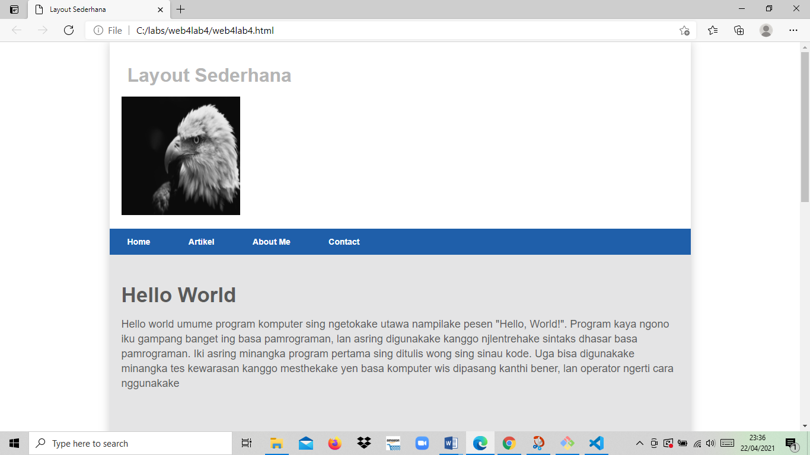
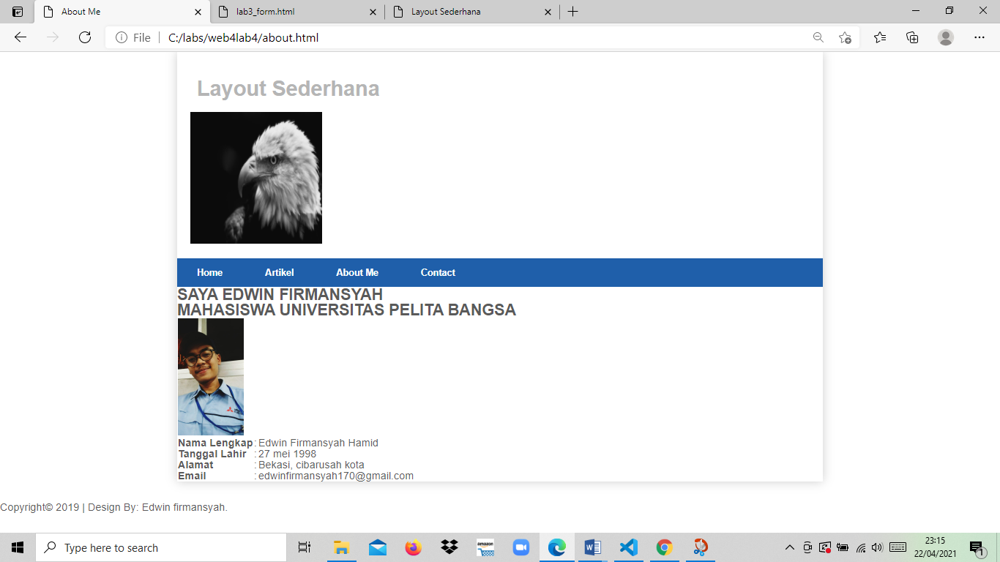
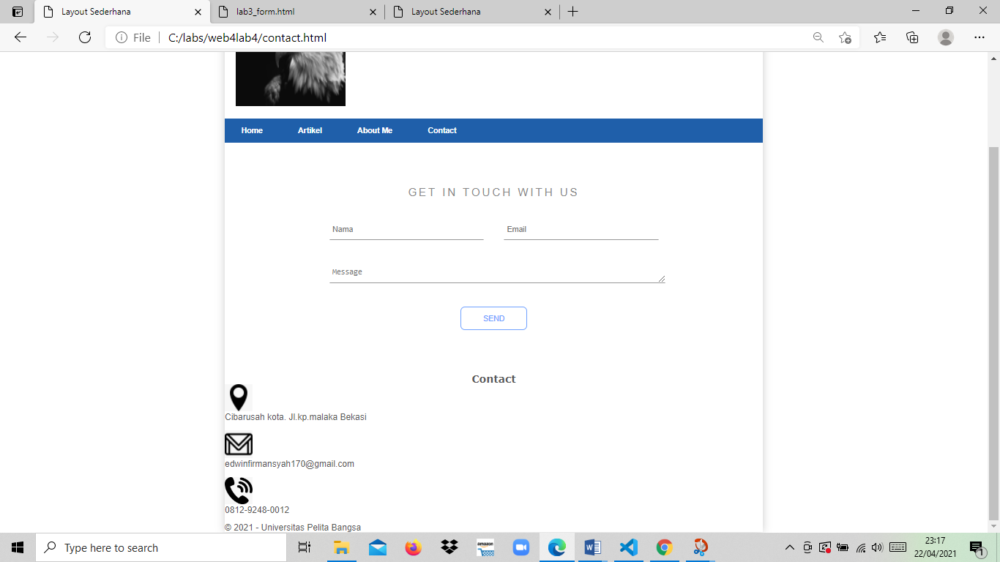

# web4lab4
## Membuat Layout Sederhana

### Menambahkan layout About dan Contact
Berikut proses menambahkan layout pada menu HTML:

Pembuatan layout untuk menu about 
Langkah Pertama :
<!DOCTYPE html>
<html lang="en">
<head>
    <meta charset="UTF-8">
    <meta http-equiv="X-UA-Compatible" content="IE=edge">
    <meta name="viewport" content="width=device-width, initial-scale=1.0">
    <title>About Me</title>
    <link rel="stylesheet" href="style.css">
</head>
<body>

    

        <header>
            <h1>Layout Sederhana</h1>
            
        </header>
        <nav>
            <a href="web4lab4.html">Home</a>
            <a href="artikel.html">Artikel</a>
            <a href="About.html">About Me</a>
            <a href="contact.html">Contact</a>
        </nav>

</body>
</html

>    
    <section id="about">
        <h1>SAYA EDWIN FIRMANSYAH</h1>
        <h2>MAHASISWA UNIVERSITAS PELITA BANGSA </h2>
        <table>
            <tr>
                <td></td>
            </tr>
            <tr>
                <td><b>Nama Lengkap</b></td>
                <td>:</td>
                <td>Edwin Firmansyah Hamid</td>
            </tr>
            <tr>
                <td><b>Tanggal Lahir</b></td>
                <td>:</td>
                <td>27 mei 1998</td>
            </tr>
            <tr>
                <td><b>Alamat</b></td>
                <td>:</td>
                <td>Bekasi, cibarusah kota</td>
            </tr>
            <tr>
                <td><b>Email</b></td>
                <td>:</td>
                <td>edwinfirmansyah170@gmail.com</td>
            </tr>
        </table>
    </section>
  

kemudian saya membuat CSS kita gabungkan agar
Hasilnya seperti ini :

<!DOCTYPE html>
<html lang="en">
 <head>
    <meta charset="UTF-8">
    <meta http-equiv="X-UA-Compatible" content="IE=edge">
    <meta name="viewport" content="width=device-width, initial-scale=1.0">
    <title>Layout Sederhana</title>
    <link rel="stylesheet" href="style.css">
 </head>
  <body>
    

        <header>
            <h1>Layout Sederhana</h1>
            
        </header>
        <nav>
            <a href="web4lab4.html">Home</a>
            <a href="artikel.html">Artikel</a>
            <a href="About.html">About Me</a>
            <a href="contact.html">Contact</a>
        </nav>

 

 </body>
 </html>
       
        

            

              <h1>Get in touch with us</h1>
              <input type="text" class="nama" placeholder="Nama">
              <input type="email" class="email" placeholder="Email">
              <textarea rows="1" placeholder="Message" class="message"></textarea>
            
  
            <button>Send</button> 
        

        <footer>
            

                <h3>Contact</h3>
                
                
Cibarusah kota. Jl.kp.malaka Bekasi
 
                
                
edwinfirmansyah170@gmail.com
 
                
                
0812-9248-0012
 
                
            

            
            
&copy; 2021 - Universitas Pelita Bangsa

        </footer>

Selanjutnya menambahkan layout sederhana
Untuk menu Contact :

<!DOCTYPE html>
<html lang="en">
 <head>
    <meta charset="UTF-8">
    <meta http-equiv="X-UA-Compatible" content="IE=edge">
    <meta name="viewport" content="width=device-width, initial-scale=1.0">
    <title>Layout Sederhana</title>
    <link rel="stylesheet" href="style.css">
 </head>
  <body>
    

        <header>
            <h1>Layout Sederhana</h1>
            
        </header>
        <nav>
            <a href="web4lab4.html">Home</a>
            <a href="artikel.html">Artikel</a>
            <a href="About.html">About Me</a>
            <a href="contact.html">Contact</a>
        </nav>
        

            

              <h1>Get in touch with us</h1>
              <input type="text" class="nama" placeholder="Nama">
              <input type="email" class="email" placeholder="Email">
              <textarea rows="1" placeholder="Message" class="message"></textarea>
            
  
            <button>Send</button> 
        

        <footer>
            

                <h3>Contact</h3>
                
                
Cibarusah kota. Jl.kp.malaka Bekasi
 
                
                
edwinfirmansyah170@gmail.com
 
                
                
0812-9248-0012
 
                
            

            
            
&copy; 2021 - Universitas Pelita Bangsa

        </footer>

/* import google font */
@import
url('https://font.googleapis.com/css2?family=Open+Sans:ital,wght@0,300;0,400;0,600;0,700;0,800;1,300;1,400;1,600;1,700;1,800&display=swap');
@import
url('https://fonts.googleapis.com/css2?family=Open+Sans+Condensed:ital,wght@0,300;0,700;1,300&display=swap');
/* Reset CSS */
*{
    margin: 0;
    padding: 0;
}
body {
    line-height:1;
    font-size:100%;
    font-family:'Open Sans', sans-serif;
    color:#5a5a5a;
    border-color:  #0f2238;
}
#container {
    width: 980px;
    margin: 0 auto;
    box-shadow: 0 0 1em #cccccc;
}
/* header */
header {
    padding: 20px;
}
header h1 {
    margin: 20px 10px;
    color: #b5b5b5;
}
header img{
    width: 200px; 
    height: 200px;
}
/* navigasi */
nav {
    display: block;
    background-color: #1f5faa;
}
nav a {
    padding: 15px 30px;
    display: inline-block;
    color: #ffffff;
    font-size: 14px;
    text-decoration: none;
    font-weight: bold;
}
nav a.active,
nav a:hover {
    background-color: #2b83ea;
}
/* Hero Panel */
#hero {
 background-color: #e4e4e5;
 padding: 50px 20px;
 margin-bottom: 20px;
}
#hero h1 {
 margin-bottom: 20px;
 font-size: 35px;
}
#hero p {
 margin-bottom: 20px;
 font-size: 18px;
 line-height: 25px;
}
/* main content */
#wrapper {
    margin: 0;
}
#main {
    float: left;
    width: 640px;
    padding: 20px;
}
/* sidebar area */
#sidebar {
    float: left;
    width: 260px;
    padding: 20px;
}
/* widget */
.widget-box {
    border:1px solid #eee;
    margin-bottom:20px;
}
.widget-box .title {
    padding:10px 16px;
    background-color:#428bca;
    color:#fff;
}
.widget-box ul {
    list-style-type:none;
}
.widget-box li {
    border-bottom:1px solid #eee;
}

.widget-box li a {
    padding:10px 16px;
    color:#333;
    display:block;
    text-decoration:none;
}
.widget-box li:hover a {
    background-color:#eee;
}
.widget-box p {
    padding:15px;
    line-height:25px;
}
.contact-section{
    background: #ffffff;
    padding: 80px 0;
    text-align: center;
  }
  
  .inner-width{
    max-width: 600px;
    margin: auto;
    padding: 0 20px;
  }
  
  .contact-section h1{
    font-size: 20px;
    font-family: Arial, Helvetica, sans-serif;
    color: #888;
    margin-bottom: 40px;
    text-transform: uppercase;
    letter-spacing: 4px;
    font-weight: 400;
  }
  
  .nama,.email,.message{
    background: none;
    border:none;
    outline: none;
    border-bottom: 1px solid;
    color: #888;
    padding: 10px 6px;
    font-size: 14px;
    margin-bottom: 40px;
  }
  
  .nama{
    float: left;
    width: 270px;
  }
  
  .email{
    float: right;
    width: 270px;
  }
  
  .message{
    min-width: 100%;
    max-width: 100%;
  }
  
  
  .contact-section button{
    background: none;
    color: #70a1ff;
    border: 1px solid #70a1ff;
    padding: 12px 40px;
    border-radius: 8px;
    text-transform: uppercase;
    font-size: 14px;
    transition: 0.4s linear;
    cursor: pointer;
  }
  
  .contact-section button:hover{
    background: #70a1ff;
    color: #fff;
  }
  
  
  @media screen and (max-width:600px){
    .name,.email{
      width: 100%;
    }
  }

  /*contact*/
.bungkus h3{
      text-align: center;
      font-weight: bold;
      font-family: Verdana, Geneva, Tahoma, sans-serif;
  }
.bungkus img{
      width: 50px;
      height: 50px;
  }
  